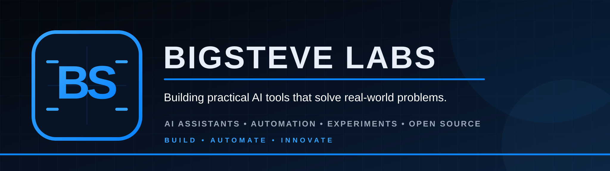

# Hi, I'm BigSteve

Founder of BigSteve Labs.

I build practical AI assistants, automation tools, and open-source projects.

## Current Projects

- MR BIG — Windows AI assistant
- BigSteve Buzz Desk — Buzz research and publishing workflow
- Home AI Lab — Local AI infrastructure and experiments
- AI Experiments — Learning, prototypes, and reusable tools

## Current Focus

- Multi-agent AI systems
- Windows AI assistants
- Local AI
- Automation
- Open-source development

## Mission

Build useful AI tools that solve real-world problems and document the journey clearly.

## Branding Preview

